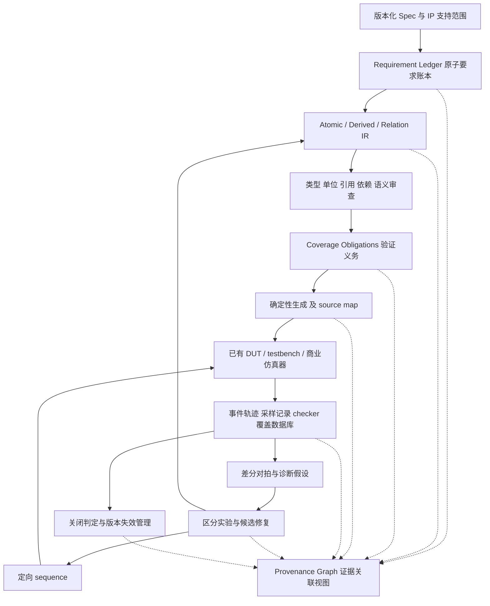

# 02 总体方案：用验证义务和证据驱动闭环

## 1. 目标及边界

系统要回答五个问题：覆盖目标为什么存在；它测量什么；仿真中实际发生了什么；没有达到目标的原因有哪些证据支持；修改之后如何证明问题已解决且没有制造新问题。

第一版服务一个已冻结的 DDR5 配置子集，支持命令识别、区间时序和少量配置条件。使用现有 DUT/testbench。复杂跨 bank 历史、训练全过程、跨频率切换、完整 DDR5 标准覆盖留待扩展。本文的“closed”只对声明范围成立。

## 2. 架构



不要把整张 provenance 图当作一个 DAG。**组合推导图**应无环；状态转移有跨时刻回边；修复历史也有版本间关系。对状态使用 `state[k+1] = f(state[k], event[k])`，只对同一时间步的组合依赖进行拓扑检查。

首版存储选择版本化 JSON/YAML、追加式 JSONL 事件及 SQLite 索引；大波形和原始数据库存文件。暂不引入图数据库服务，先把关联与版本语义做正确。后续可从同一对象模型生成图查询视图。

## 3. 三层 IR 之外增加两个必要层

**Requirement Ledger 在 IR 之前。** 将规范的原子要求独立编号，保存适用配置、原文及审阅记录。这样才能发现“规范有要求，但 IR 根本没提取”的遗漏。如果分母只来自生成的 bins，漏掉的要求永远不可见。

**Coverage Obligation 在 Relation 之后。** 一个时序关系会产生多个验证义务，例如边界命中、合法区间、触发可观测性、负向 checker 检测。义务与 bin 不是强制一对一；一个 cross 或状态转换可落实多个要求。每个义务说明 why、where、when、how、checker 和完成证据。

Atomic 描述采样/配置事实；Derived 使用受限 typed op 表达组合变换、状态更新和测量；Relation 表达适用条件下的协议约束。自由文本用于解释，不能直接作为未检查的 SV 表达式。生成器仅支持明确列出的操作，如 `field_extract / concat / compare / last_event / elapsed_time / interval_check`。

## 4. 三种正确性分别验证

1. **规格→IR 语义正确性**：来源位置可打开；表格、图、脚注一起解释；独立审阅边界和例外；有少量手工判定轨迹。
2. **IR→代码实现正确性**：编译与 elaboration；同一输入轨迹上，对比独立参考解释器与生成 monitor 的事件、历史状态、门控和分类结果。
3. **运行场景的 DUT 正确性**：现有 checker/scoreboard/assertion 通过，且所需事件确实由 DUT 接口观测得到。

IR 解释器与生成代码共享同一份错误 IR，最多证明实现一致。因此仍需独立规范审阅和手工 oracle。已有 DDR5 monitor 如果被用于生成输入，也不能未经额外检查直接成为评测真值。

禁止用“coverage hit”代替“DUT 行为正确”；禁止用 driver 请求代替 monitor 观测；禁止用编译成功代替语义验证。

## 5. 运行证据与差分诊断

每个监视链路记录六级可观察量：

```text
driver intent → 原始 pin/事务 → 解码事件 → scoped 历史状态
              → sample_valid 与 operands → bin outcome 与 checker verdict
```

对未命中 bin，先确认运行有效和目标适用，再比较相邻级别。一个目标可以有多个根因；诊断输出是带证据状态的假设集合，不强制唯一分类。

| 分类 | 必需的区分证据 | 修复路径 |
|---|---|---|
| A_SPEC_IR | 原文/脚注与 IR 有明确矛盾，或要求遗漏；独立审阅记录 | 修要求映射或 IR，重生成全部受影响产物 |
| B_MODEL | IR 已核对；同一轨迹参考值与生成 monitor/采样/bin 结果不一致 | 修模板、binding、解码或采样，重放最小反例和回归 |
| C_STIMULUS | 存在已通过合法性检查的目标见证；旧轨迹未覆盖；实际执行后可命中 | 增加/调整 sequence 或约束，仿真确认真实执行 |
| D_UNREACHABLE | 给定配置、模型、假设下的可复核矛盾或充分证明 | 生成 scoped exclusion 记录，保持原目标存在 |
| E_ENV | 编译、license、运行、绑定、日志/coverage 导出失效 | 修环境或适配器，重新运行 |
| F_DUT | 合法输入实际执行，独立 checker 与 DUT 结果不一致 | 输出 DUT 问题和最小复现；进入 DUT 修复后回归 |
| UNKNOWN / MULTIPLE | 证据不足或多个假设仍成立 | 选择区分实验，不下已确认结论 |

“合法见证存在但 controller 的事务接口不能精确调到边界”可能是 driver 能力限制，不是协议不可达；需要单独记录 `stimulus_control_limit`，换控制点或缩小可主张范围。

语义矛盾不总能自动形式化，A 类允许人工审阅；规则检查覆盖不了任意自然语言。C 类在实际执行前只能是候选。D 类绝不能用多次随机失败推导。

## 6. 区分实验与修复事务

当“IR 阈值错”和“采样器错”都能解释 miss 时，先回放一条经独立确认的边界轨迹；比较规范 oracle、IR 解释结果和 SV 结果。相同环境中只改变一个因素，记录干预对象和未改变的版本。多缺陷情况下，一次修复有效也不能证明它是唯一根因。

修复是一个显式事务：

```text
proposed → validated → applied_as_new_revision → replayed → accepted / rejected
```

修复记录含原因、证据、base revision、patch、受影响节点、最小反例、预期结果、实际结果和回滚点。模板修复要重跑所有依赖该模板的规则；禁止只手改生成 SV 而不更新生成来源。

自动执行范围可包括受限事务激励、通过 gate 的局部模板/IR 修复候选。修改规格解释、改目标分母和不可达排除必须有显式审阅记录；这是一项未来系统的验收规则，不是本次规划工作的额外审批要求。

## 7. 状态与版本语义

分开存三条状态轴，避免把“uncovered”和“model invalid”混成一个字段：

- validity：draft / reviewed / validated / invalid / stale。
- progress：unobserved / observed / verified_hit。
- disposition：active / proven_unreachable / waived / unresolved。

`verified_hit` 要求关联已通过模型有效性 gate 的 bin，在有效运行中有可定位 sample witness，且相关 checker 通过。目标命中但 checker 失败，保留 raw hit，禁止进入 verified hit。

规格、IR、生成器、binding、配置、DUT 或 checker 任一版本变化时，根据影响依赖使相应证据 stale。保留历史事实，不把旧 hit 直接迁移到新语义版本。重放缓存轨迹可重新认证模型行为，但替代不了 DUT 版本变化后的必要仿真。

合并前比较 `spec/plan/IR/model/binding/config/DUT/checker` 指纹及工具采样语义；不同配置单列汇总。去重键至少为 `(run_id, event_id, bin_revision)`。事件重导入不得累加命中次数。

## 8. 度量和关闭条件

对冻结配置 c，定义：`B_c` 为预先登记的全部合法目标；`U_c` 为已证明不可达目标；`W_c` 为仅经工程豁免的目标；`H_c` 为当前有效版本上的 verified-hit 集合。U/W/H 互斥，冲突先阻断计分。

```text
运行闭环覆盖率 = |H_c| / (|B_c| - |U_c|)
审计处置率     = |H_c ∪ U_c ∪ W_c| / |B_c|
要求建模完整度 = 已审阅且落实为义务的 scope 内要求 / scope 内冻结要求
```

未命中、无观测、模型无效、stale、unknown 都留在运行覆盖率分母中。W 不冒充 U，不从严格闭环分母剔除。分母为 0 时显示 N/A 和原因，不能自动记 100%。表中另列 raw hit、invalid、stale、unknown、U、W 的绝对数量。

严格 `closed` 条件：要求建模完整度 100%；所有 active 目标经模型 gate；`B_c = H_c ∪ U_c`；无未解决相关 checker 错误；证据链完整；所需回归通过；无过期 exclusion。含 W 的工程接受应明确写 `accepted_with_waivers`。

停止运行与完成关闭是不同事件：`closed / stalled / budget_exhausted / blocked / needs_review` 分开报告。连续 K 轮无进展只触发 stalled 和未解决清单。

## 9. 不可达的证明强度

配置矛盾：在已冻结且不可在本轮改变的配置条件下，目标与约束不可同时满足，可记 `config_unsat`。如目标要求 MR2=0，而本 scope 保证其一直为 1，需记录固定性来源；若测试能改 MR2，就不能如此排除。

时序不可达：带初始状态、转移、环境假设和可达深度。BMC 深度 k 的 UNSAT 仅支持 `unreachable_up_to_k`；通常不进入严格 U 集。只有显式限定为 k 步场景的目标，或获得完备界/归纳证明，才允许相应范围的不可达结论。SAT witness 必须映射到可执行激励；solver unknown/timeout 留 unresolved。

## 10. 贝叶斯研究的后置位置

收集独立标签后，使用每目标依赖子图中的假设 H，结合事件差分、环境诊断、规范审阅和干预结果 E 计算 `P(H|E,config,strategy,version)`。区分排序分数与校准概率，允许拒判。

同一证据不重复更新；同轨迹多 bin 用分组建模或显式相关性处理；修复后切换对象版本，旧错误率不能直接当新正确性。通过 held-out 数据评价 top-k、校准、成本与错误关闭率；与确定性诊断基线相比无增益时，首版系统仍可完整工作。
